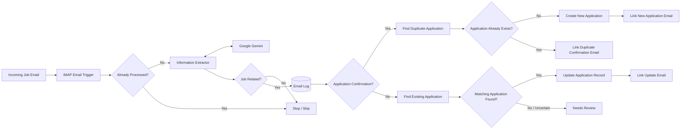

```mermaid
flowchart LR

 A[Incoming Job Email]
    B[IMAP Email Trigger]
    C{Already Processed?}
    D[Information Extractor]
    E[Google Gemini]
    F{Job Related?}
    G[(Email Log)]
    H{Application Confirmation?}
    I[Find Duplicate Application]
    J{Application Already Exists?}
    K[Create New Application]
    L[Link New Application Email]
    M[Find Existing Application]
    N{Matching Application Found?}
    O[Update Application Record]
    P[Link Update Email]
    Q[Needs Review]

    A --> B
    B --> C

    C -->|No| D
    C -->|Yes| R[Stop / Skip]

    D <--> E

    D --> F

    F -->|No| R
    F -->|Yes| G

    G --> H

    H -->|Yes| I
    H -->|No| M

    I --> J

    J -->|No| K
    K --> L

    J -->|Yes| S[Link Duplicate Confirmation Email]

    M --> N

    N -->|Yes| O
    O --> P

    N -->|No / Uncertain| Q
```
